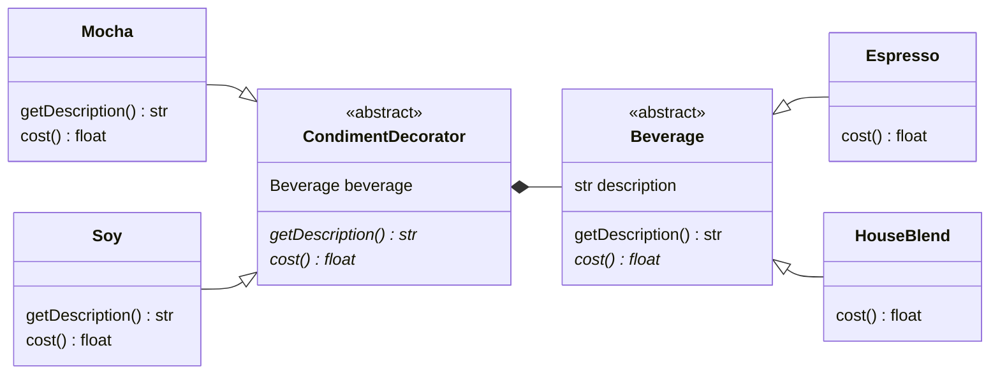

```mermaid 
classDiagram
    direction LR

    class Beverage {
        <<abstract>>           
        
        str description

        getDescription() str
        cost()* float
    }

    class Espresso {
        cost() float

    }

    class HouseBlend {
        cost() float
    }

    CondimentDecorator *-- Beverage

    Beverage <|-- Espresso
    Beverage <|-- HouseBlend


    class CondimentDecorator {
        <<abstract>>

        Beverage beverage
        getDescription()* str
        cost()* float
    }

    

    class Mocha {
        getDescription() str
        cost() float
    }    


    class Soy {
        getDescription() str
        cost() float
    }

    Mocha --|> CondimentDecorator
    Soy --|> CondimentDecorator

```