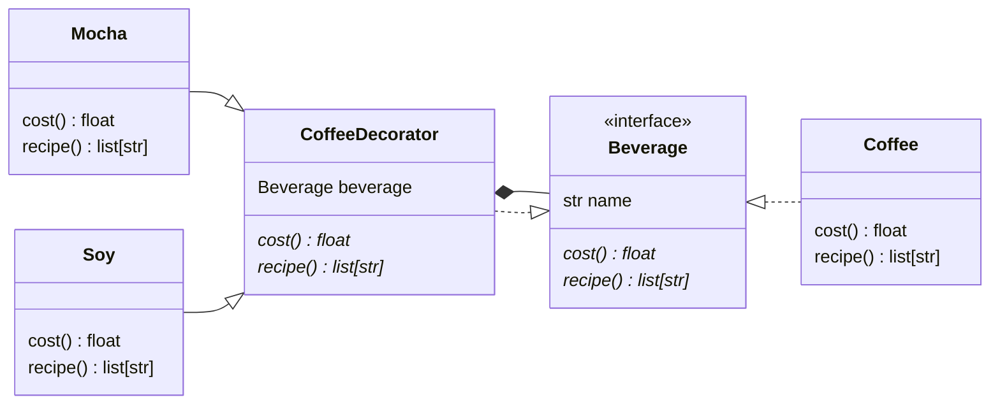

```mermaid 
classDiagram
    direction LR

    class Beverage {
        <<interface>>
        str name

        cost()* float
        recipe()* list[str]
    }

    class Coffee {
        cost() float
        recipe() list[str]

    }


    CoffeeDecorator *-- Beverage
    CoffeeDecorator ..|> Beverage

    Beverage <|.. Coffee

    class CoffeeDecorator {
        Beverage beverage
        
        cost()* float
        recipe()* list[str]
    }

    

    class Mocha {
        cost() float
        recipe() list[str]
    }    


    class Soy {
        cost() float
        recipe() list[str]
    }

    Mocha --|> CoffeeDecorator
    Soy --|> CoffeeDecorator

```