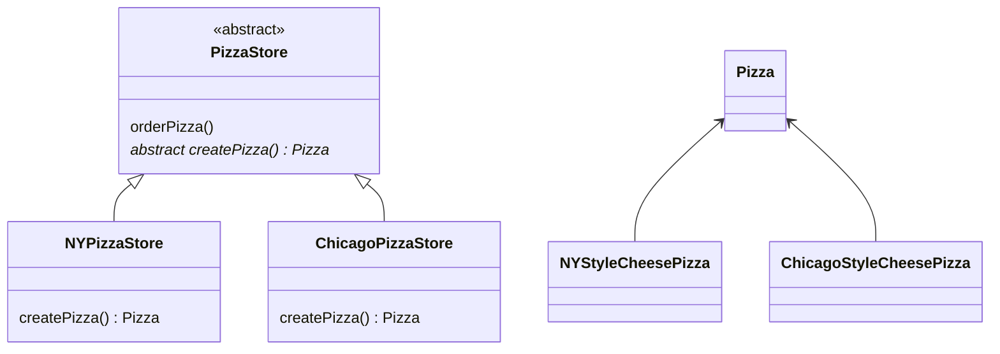

```mermaid 
classDiagram
    direction BT

    class PizzaStore{
        <<abstract>>
        orderPizza()
        abstract createPizza()* Pizza
    }

    class NYPizzaStore {
        createPizza() Pizza
    }

    class ChicagoPizzaStore {
        createPizza() Pizza
    }

    NYPizzaStore --|> PizzaStore
    ChicagoPizzaStore --|> PizzaStore

    class Pizza {

    }

    class NYStyleCheesePizza {

    }

    class ChicagoStyleCheesePizza {

    }

    NYStyleCheesePizza --> Pizza 
    ChicagoStyleCheesePizza --> Pizza 
```