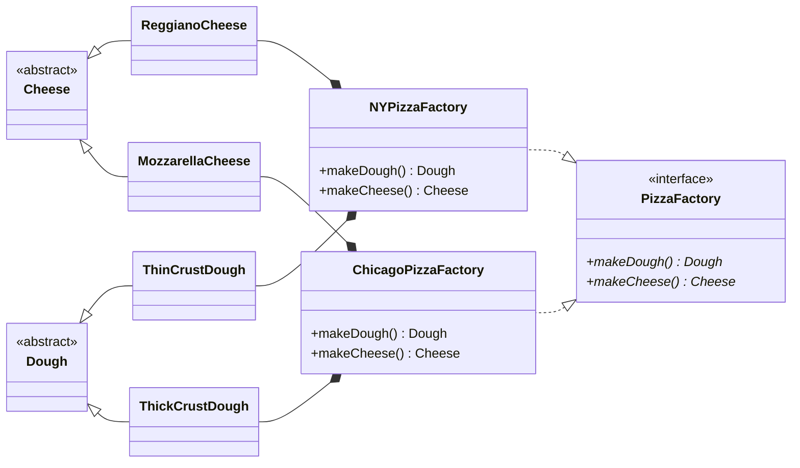

```mermaid 
classDiagram
    direction RL

    class Dough {
        <<abstract>>
    }

    class Cheese {
        <<abstract>>
    }

    class ThinCrustDough {
        
    }

    class ThickCrustDough {
        
    }

    ThinCrustDough --|> Dough
    ThickCrustDough --|> Dough

    class PizzaFactory {
        <<interface>>
        +makeDough() Dough*
        +makeCheese() Cheese*
    }

    class NYPizzaFactory {
        +makeDough() Dough
        +makeCheese() Cheese
    }
    

    class ChicagoPizzaFactory {
        +makeDough() Dough
        +makeCheese() Cheese
    }
    
    class ReggianoCheese {
    }

    class MozzarellaCheese {

    }

    ReggianoCheese --|> Cheese
    MozzarellaCheese --|> Cheese

    NYPizzaFactory *-- ReggianoCheese
    NYPizzaFactory *-- ThinCrustDough

    ChicagoPizzaFactory *-- MozzarellaCheese
    ChicagoPizzaFactory *-- ThickCrustDough

    PizzaFactory <|.. NYPizzaFactory
    PizzaFactory <|.. ChicagoPizzaFactory
```
