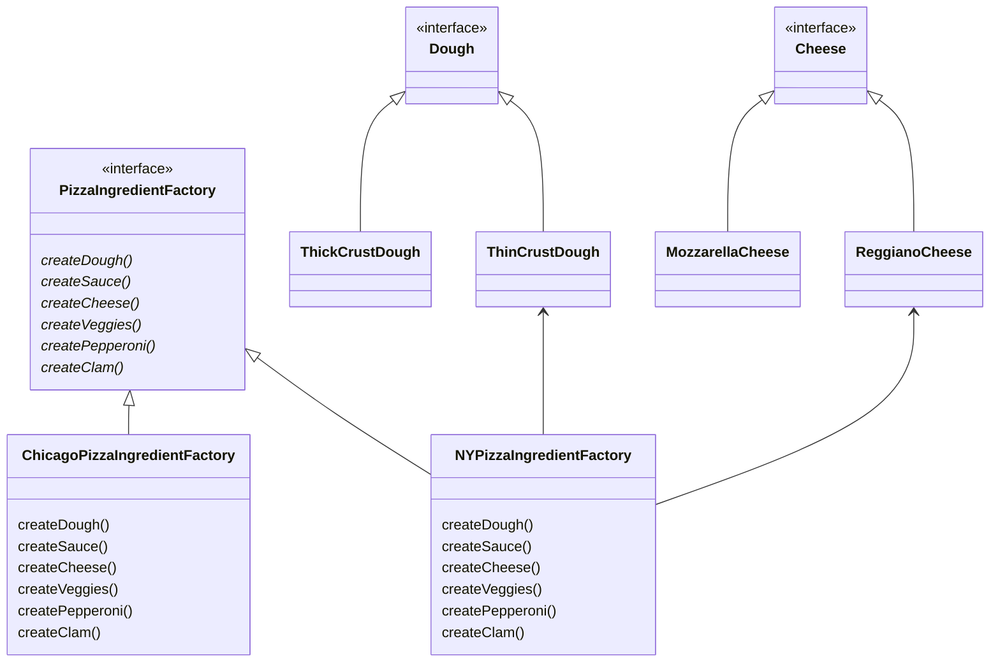

```mermaid 
classDiagram
    direction BT

    class PizzaIngredientFactory {
        <<interface>>

        createDough()*
        createSauce()*
        createCheese()*
        createVeggies()*
        createPepperoni()*
        createClam()*
    }

    class NYPizzaIngredientFactory {
        createDough()
        createSauce()
        createCheese()
        createVeggies()
        createPepperoni()
        createClam()
    }
    

    class ChicagoPizzaIngredientFactory {
        createDough()
        createSauce()
        createCheese()
        createVeggies()
        createPepperoni()
        createClam()
    }

    NYPizzaIngredientFactory --|> PizzaIngredientFactory
    ChicagoPizzaIngredientFactory --|> PizzaIngredientFactory

    class Dough {
        <<interface>>
    }

    class Cheese {
        <<interface>>
    }

    class ThinCrustDough {
        
    }

    class ThickCrustDough {
        
    }

    ThinCrustDough --|> Dough
    ThickCrustDough --|> Dough
    
    class ReggianoCheese {
    }

    class MozzarellaCheese {

    }

    ReggianoCheese --|> Cheese
    MozzarellaCheese --|> Cheese

    NYPizzaIngredientFactory --> ReggianoCheese
    NYPizzaIngredientFactory --> ThinCrustDough
    
    
```