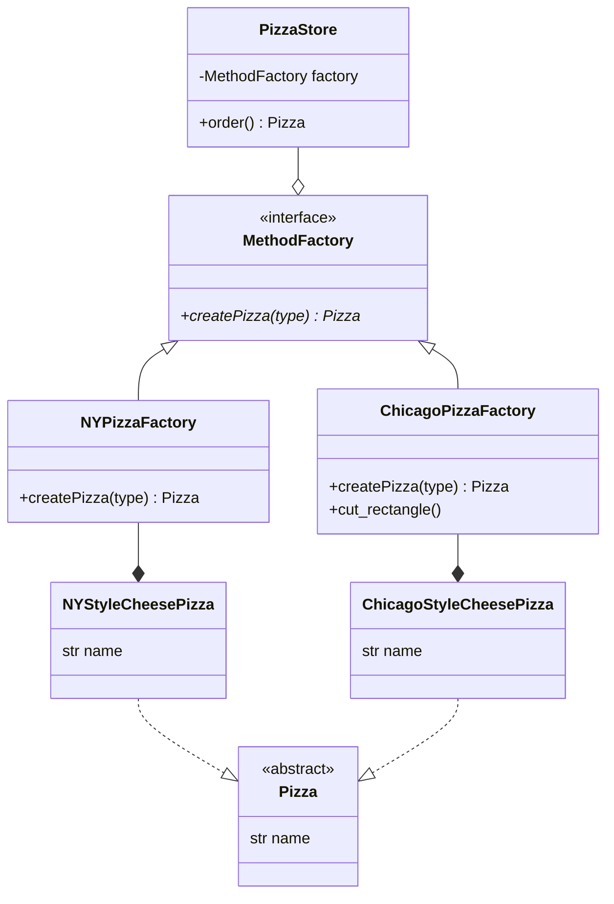

```mermaid
classDiagram
direction TB
    class PizzaStore {
        -MethodFactory factory
        +order() Pizza
    }

    PizzaStore --o MethodFactory

    class MethodFactory {
        <<interface>>
        +createPizza(type) Pizza*
    }
    
    class NYPizzaFactory {
        +createPizza(type) Pizza
    }

    class ChicagoPizzaFactory {
        +createPizza(type) Pizza
        +cut_rectangle()
    }

    MethodFactory <|-- NYPizzaFactory
    MethodFactory <|-- ChicagoPizzaFactory

    class Pizza {
        <<abstract>>
        str name
    }

    class NYStyleCheesePizza {
        str name
    }

    class ChicagoStyleCheesePizza {
        str name
    }

    NYStyleCheesePizza ..|> Pizza
    ChicagoStyleCheesePizza ..|> Pizza

    NYPizzaFactory --* NYStyleCheesePizza
    ChicagoPizzaFactory --* ChicagoStyleCheesePizza
```
