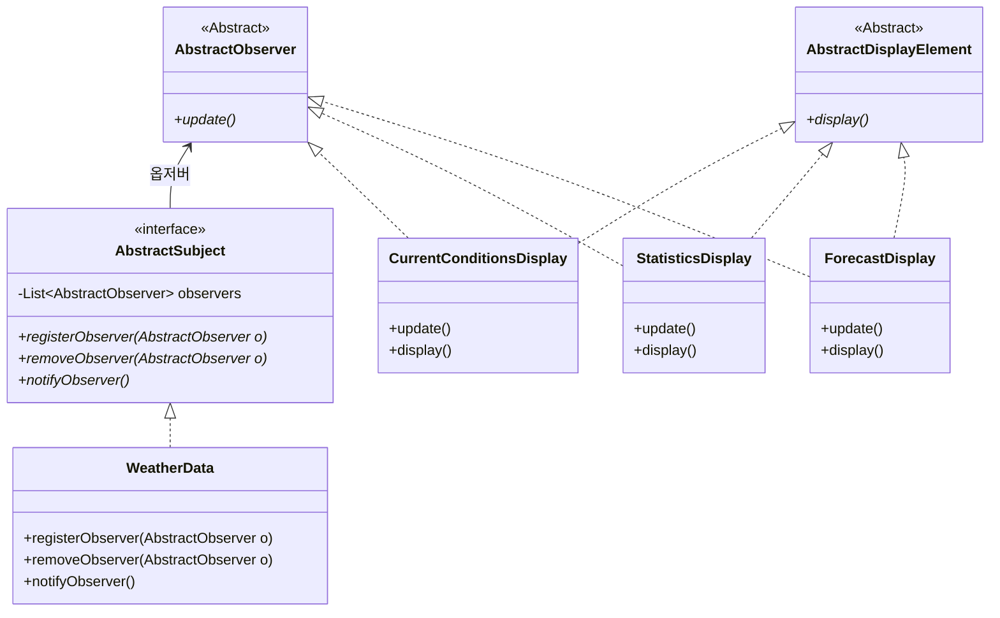

```mermaid 
classDiagram
    direction BT

    class AbstractSubject {
        <<interface>>
        -List~AbstractObserver~ observers

        +registerObserver(AbstractObserver o)*
        +removeObserver(AbstractObserver o)*
        +notifyObserver()*
    }

    class AbstractObserver {
        <<Abstract>>

        +update()*
    }
    
    AbstractSubject --> AbstractObserver : 옵저버

    class AbstractDisplayElement {
        <<Abstract>>

        +display()*
    }

    class WeatherData {
        +registerObserver(AbstractObserver o)
        +removeObserver(AbstractObserver o)
        +notifyObserver()
    }

    WeatherData ..|> AbstractSubject

    class CurrentConditionsDisplay {
        +update()
        +display()
    }

    class StatisticsDisplay {
        +update()
        +display()
    }

    class ForecastDisplay {
        +update()
        +display()
    }

    CurrentConditionsDisplay ..|> AbstractObserver
    StatisticsDisplay ..|> AbstractObserver
    ForecastDisplay ..|> AbstractObserver

    CurrentConditionsDisplay ..|> AbstractDisplayElement
    StatisticsDisplay ..|> AbstractDisplayElement
    ForecastDisplay ..|> AbstractDisplayElement

```