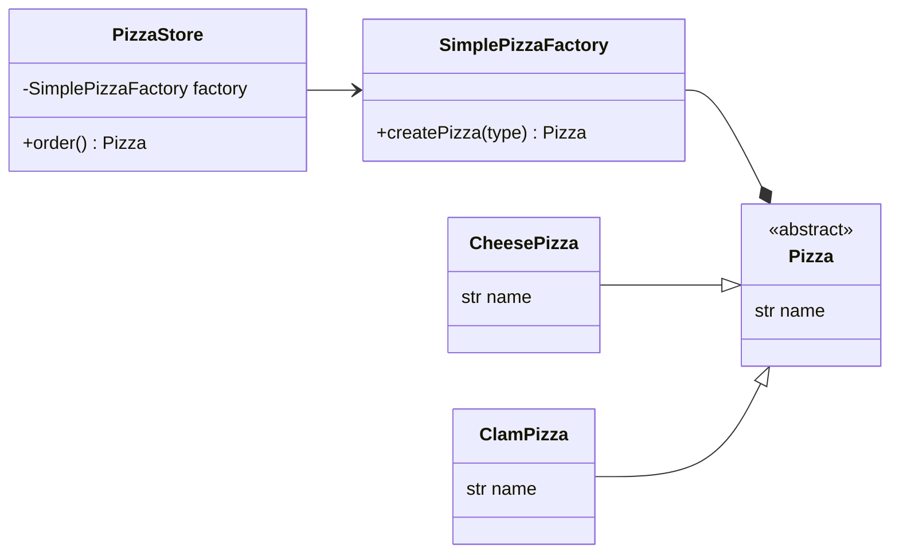

```mermaid 
classDiagram
    direction LR

    class PizzaStore {
        -SimplePizzaFactory factory
        +order() Pizza
    }

    class SimplePizzaFactory {
        +createPizza(type) Pizza
    }

    PizzaStore --> SimplePizzaFactory

    class Pizza {
        <<abstract>>
        str name
    }

    SimplePizzaFactory --* Pizza

    class CheesePizza {
        str name
    }

    class ClamPizza {
        str name
    }

    CheesePizza --|> Pizza  
    ClamPizza --|> Pizza  
```
