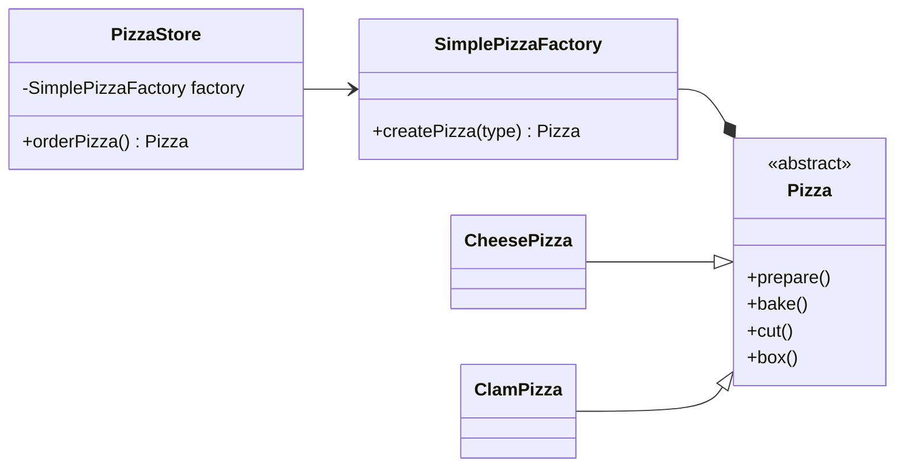

```mermaid 
classDiagram
    direction LR

    class PizzaStore {
        -SimplePizzaFactory factory
        +orderPizza() Pizza
    }

    class SimplePizzaFactory {
        +createPizza(type) Pizza
    }

    PizzaStore --> SimplePizzaFactory

    class Pizza {
        <<abstract>>

        +prepare()
        +bake()
        +cut()
        +box()
    }

    SimplePizzaFactory --* Pizza

    class CheesePizza {

    }

    class ClamPizza {

    }

    CheesePizza --|> Pizza  
    ClamPizza --|> Pizza  

```