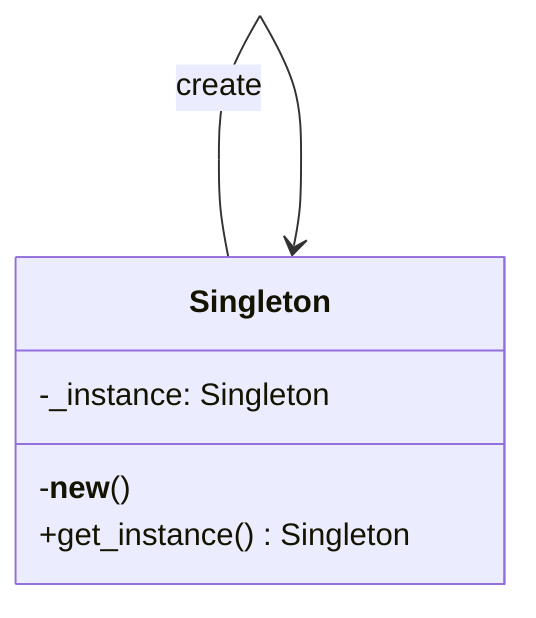

# GoF Singleton

```mermaid
classDiagram
    direction BT

    class Singleton{
        -_instance: Singleton

        -__new__()
        +get_instance() Singleton
    }

    Singleton --> Singleton : create
```
