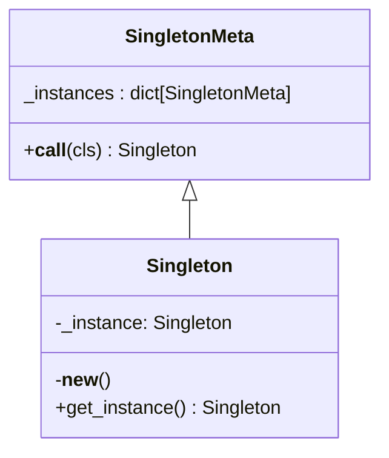

# Meta Singleton

## Meta 클래스

- type 을 상속 받아서 구현 가능
- 클래스의 생성 방식을 제어
- 클래스의 속성, 메서드 등을 동적으로 수정
- 클래스 생성 시 추가 로직을 실행

```mermaid
classDiagram
    direction BT

    class SingletonMeta{
        _instances : dict[SingletonMeta]
        +__call__(cls) Singleton
    }

    class Singleton{
        -_instance: Singleton

        -__new__()
        +get_instance() Singleton
    }

    Singleton --|> SingletonMeta
```
