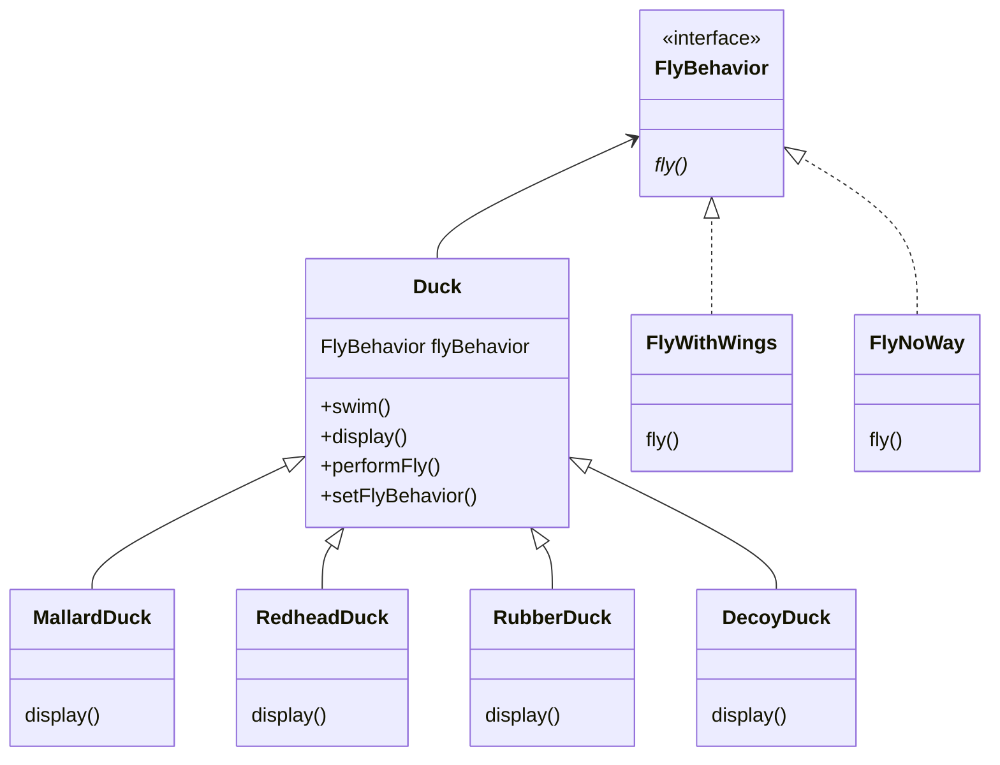

```mermaid 
classDiagram
    direction BT

    class Duck {
        FlyBehavior flyBehavior
        
        +swim()
        +display()
        +performFly()
        +setFlyBehavior()
    }
    
    class MallardDuck {
        display()
    }

    class RedheadDuck {
        display()
    }

    class RubberDuck {
        display()
    }

    class DecoyDuck {
        display()
    }

    MallardDuck --|> Duck 
    RedheadDuck --|> Duck 
    RubberDuck --|> Duck 
    DecoyDuck --|> Duck 

    class FlyBehavior {
        <<interface>>
        fly()*
    }

    Duck --> FlyBehavior

    class FlyWithWings {
        fly()
    }

    class FlyNoWay {
        fly()
    }

    FlyWithWings ..|> FlyBehavior
    FlyNoWay ..|> FlyBehavior
```